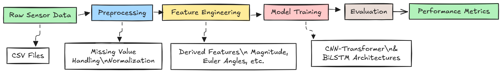
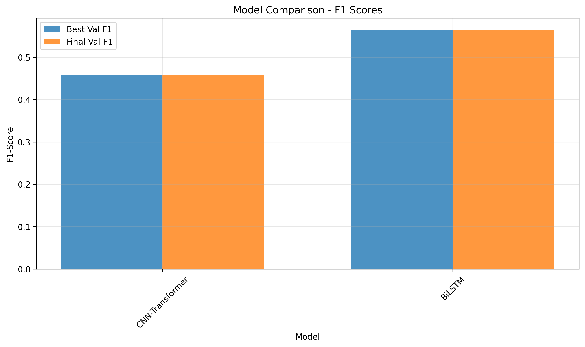
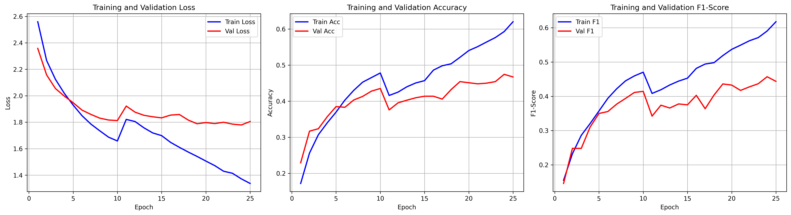
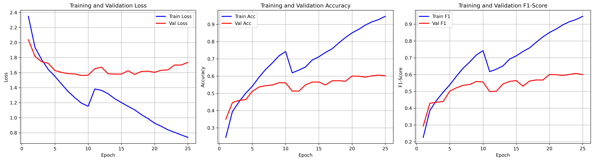

# Multi-Modal Gesture Recognition using Deep Learning

A comprehensive deep learning solution for classifying human gestures using multimodal sensor data. This project implements and compares CNN-Transformer hybrid and BiLSTM architectures for sequential gesture recognition.

## Project Overview

This project addresses the challenge of automated gesture recognition using temporal sensor data from accelerometers, thermopile sensors, time-of-flight sensors, and rotation quaternions. The solution demonstrates advanced deep learning techniques for multimodal time series classification.

**Key Achievements:**
- Implemented two state-of-the-art neural architectures
- BiLSTM achieved **56.59% accuracy** and **0.5641 F1-score**
- CNN-Transformer achieved **47.46% accuracy** and **0.4570 F1-score**
- Comprehensive data preprocessing pipeline with feature engineering
- Training pipeline with early stopping and model checkpointing

## Dataset

The dataset contains multimodal sensor readings for 18 distinct gesture classes:

| Sensor Type | Features | Description |
|-------------|----------|-------------|
| Accelerometer | `acc_x`, `acc_y`, `acc_z` | 3D motion acceleration |
| Thermopile | `thm_*` | Multi-point thermal readings |
| Time-of-Flight | `tof_*` | Distance measurements |
| Rotation | `rot_w`, `rot_x`, `rot_y`, `rot_z` | 3D orientation quaternions |

**Target Classes (18):** Hair pulling, skin pinching, object interaction, scratching, phone usage, writing gestures, and more.


### Workflow 



### Model Architectures

**CNN-Transformer Hybrid:**
- 1D Convolution layers for local feature extraction
- Transformer encoder for sequence modeling
- Positional encoding for temporal awareness
- Multi-layer classifier with dropout

**BiLSTM:**
- Bidirectional LSTM for sequential pattern capture
- Handles variable-length sequences
- Dense classification layers

## Results

### Performance Comparison



| Model | Best Val Accuracy | Best Val F1-Score | Parameters |
|-------|------------------|-------------------|------------|
| BiLSTM | **56.59%** | **0.5641** | ~180K |
| CNN-Transformer | 47.46% | 0.4570 | ~350K |

### Training Curves

**CNN-Transformer Training Progress:**


**BiLSTM Training Progress:**


### Analysis
- BiLSTM outperforms CNN-Transformer by 9% in accuracy
- BiLSTM shows better convergence and stability
- CNN-Transformer exhibits overfitting with significant train-validation gap
- Both models struggle with gesture classes having limited samples

## Quick Start

### Prerequisites
```bash
pip install -r requirements.txt
```

### Setup and Execution

1. **Download Dataset:**
```bash
python download_dataset.py
```

2. **Run Tests:**
```bash
python test.py --full
```

3. **Train Models:**
```bash
python train.py
```

### Project Structure
```
├── dataset/           # Data files
├── results/           # Model outputs & visualizations  
├── utils.py          # Data preprocessing
├── model.py          # Neural architectures
├── train.py          # Training pipeline
└── test.py           # Evaluation scripts
```

##  Technical Implementation

### Data Preprocessing Pipeline

```python
# Key preprocessing steps
def preprocess_data(df):
    # Handle missing values strategically
    df[tof_cols] = df[tof_cols].fillna(-1)
    df[thm_cols] = df[thm_cols].fillna(df[thm_cols].mean())
    
    # Feature engineering
    df['acc_mag'] = np.sqrt(df['acc_x']**2 + df['acc_y']**2 + df['acc_z']**2)
    df['euler_roll'] = np.arctan2(2*(w*x + y*z), 1-2*(x**2 + y**2))
    
    # Standardization
    scaler = StandardScaler()
    df[feature_cols] = scaler.fit_transform(df[feature_cols])
```

### Model Architecture Snippets

**CNN-Transformer:**
```python
def forward(self, x, mask=None):
    # 1D Convolution for feature extraction
    x = self.conv1(x.permute(0, 2, 1))
    x = self.conv2(x)
    
    # Transformer encoding
    x = self.pos_encoder(x.permute(0, 2, 1))
    x = self.transformer(x, src_key_padding_mask=mask)
    
    # Classification
    return self.classifier(x.mean(dim=1))
```

### Training Configuration

```python
# Optimal hyperparameters
config = {
    'hidden_dim': 256,
    'learning_rate': 5e-4,
    'batch_size': 64,
    'epochs': 50,
    'optimizer': 'AdamW',
    'scheduler': 'CosineAnnealingWarmRestarts'
}
```

## Detailed Results Analysis

### Confusion Matrix Insights


### Per-Class Performance

| Gesture | Precision | Recall | F1-Score |
|---------|-----------|---------|----------|
| Text on phone | 0.84 | 0.84 | 0.84 |
| Glasses on/off | 0.86 | 0.78 | 0.82 |
| Above ear - pull hair | 0.66 | 0.70 | 0.68 |
| Write name in air | 0.44 | 0.75 | 0.56 |

## Key Contributions

1. **Advanced Architecture Design**: Implemented hybrid CNN-Transformer combining local and global feature learning
2. **Comprehensive Feature Engineering**: Created 15+ derived features from raw sensor data
3. **Robust Training Pipeline**: Integrated early stopping, learning rate scheduling, and model checkpointing
4. **Thorough Evaluation**: Multi-metric assessment with detailed per-class analysis
5. **Production-Ready Code**: Modular, well-documented, and easily reproducible

## Future Improvements

- **Data Augmentation**: Implement time-series specific augmentation techniques
- **Attention Mechanisms**: Add cross-modal attention for better sensor fusion
- **Ensemble Methods**: Combine predictions from multiple architectures
- **Hyperparameter Optimization**: Automated tuning using Optuna or Ray Tune
- **Real-time Inference**: Optimize models for edge deployment

##  Technical Stack

- **Deep Learning**: PyTorch, torchvision
- **Data Processing**: pandas, numpy, scikit-learn
- **Visualization**: matplotlib, seaborn
- **Utilities**: tqdm, joblib
